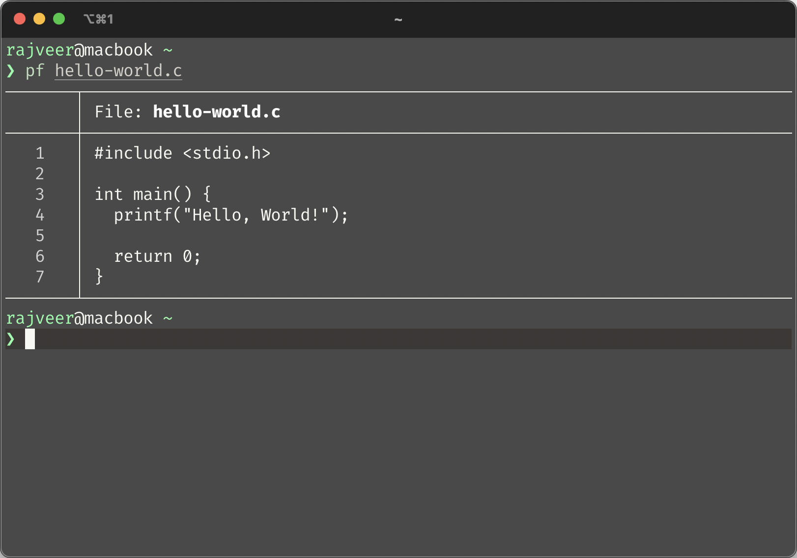

# pf-c

This program is designed to provide a clean and straightforward way to read and display the contents of your code files. It strips away unnecessary bells and whistles, focusing solely on presenting your code in a clear and readable format.

## How to Use

To use the application, follow these steps:

1. Clone the repository.
2. Navigate to the project directory.
3. Run `make pf-c`

### Command

`$ ./pf-c /path/to/fileß`
